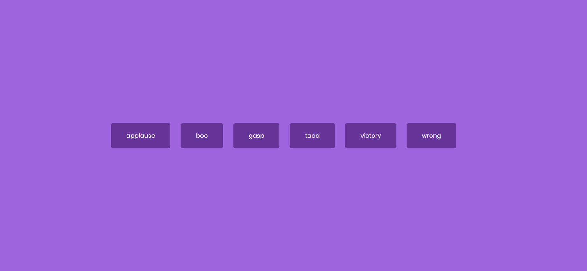

# Sound Board

This is the [Sound Board project (Day 9) in the Udemy course 50 projects in 50 Days](https://www.udemy.com/course/50-projects-50-days/?src=sac&kw=50+projects+50+days).

## Project Details

The goal of the project is to create buttons utilizing the HTML5 audio tag that play the corresponding sound when clicked.

### View My Project: 

## Features

- Clickable buttons that play the corresponding sounds.

## Technologies Used

- HTML5
- CSS3
- JavaScript

## My Process

- Start the files from a boiler template.
- Add the audio tags in the index.html.
- Add JavaScript to target the buttons and play a specific sound for each button when clicked.
- Add styles for visual appeal.
- Update JavaScript to ensure only one sound is heard if multiple buttons are clicked in quick succession.

### Continued development

This is the first time I have used the HTML5 audio tags. My goal is to take this lesson and apply it to a more complex project.

## Acknowledgements

Original Project idea: Brad Traversy, Florin Pop [Udemy course 50 Projects in 50 Days](https://www.udemy.com/course/50-projects-50-days/?src=sac&kw=50+projects+50+days)

Original HTML, CSS & Javascript provided by: Brad Traversy, Florin Pop [Udemy course 50 Projects in 50 Days](https://www.udemy.com/course/50-projects-50-days/?src=sac&kw=50+projects+50+days)

Sound Effects: [Pixabay](https://pixabay.com/sound-effects/?utm_source=link-attribution&utm_medium=referral&utm_campaign=music&utm_content=6253),  [Nhựt Bùi](https://pixabay.com/users/eritnhut1992-25656588/?utm_source=link-attribution&utm_medium=referral&utm_campaign=music&utm_content=20582) on [Pixabay](https://pixabay.com/sound-effects//?utm_source=link-attribution&utm_medium=referral&utm_campaign=music&utm_content=20582)